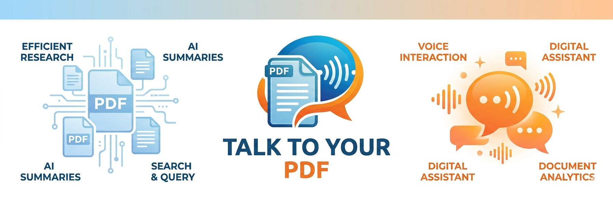

<p align="center">
  
</p>

<p align="center">
  <strong>A fully local, privacy-first RAG application that lets you chat with your PDF documents.</strong><br/>
  No cloud. No API keys. Everything runs on your machine.
</p>

<p align="center">
  
  
  
  
  
  
  
</p>

---

## What it does

Upload one or more PDFs, ask questions in natural language, and get answers grounded in the actual document content — with citations pointing to the exact page the answer came from. The entire pipeline runs locally using [Ollama](https://ollama.com/), so your documents never leave your machine.

---

## Features

- **Multi-PDF support** — Upload multiple documents per session and query across all of them at once
- **Semantic section chunking** — Headings (Abstract, Introduction, Methods …) are detected and stored as chunk metadata so the model always knows which section it's reading
- **Confident citations only** — Citations appear only when the LLM explicitly references a source with `[1]`, `[2]` … inline markers; random or low-confidence references are suppressed
- **Real-time streaming** — Responses stream token-by-token over WebSocket
- **Auto session recovery** — If a session expires the client silently creates a new one without an error screen
- **Session file cleanup** — All uploaded files and vectors are automatically deleted when a session expires
- **Black & white UI** — Clean, distraction-free interface with chat avatars and a PDF dock tab bar
- **One-command startup** — A single PowerShell script checks prerequisites, builds images, and opens the browser

---

## Architecture

```
┌─────────────────────────────────────────────────┐
│                   Browser                        │
│  React + Vite  ──WebSocket──▶  FastAPI backend  │
└─────────────────────────────────────────────────┘
          │                          │
          │ PDF render          ┌────┴────┐
          │ (pdfjs-dist)        │  Redis  │  sessions & message history
          │                     └────┬────┘
          │                          │
          │                    ┌─────┴─────┐
          │                    │  Qdrant   │  vector store (per session)
          │                    └─────┬─────┘
          │                          │
          │                    ┌─────┴─────┐
          │                    │  Ollama   │  embeddings + generation
          │                    └───────────┘
```

| Service | Technology |
|---------|-----------|
| Frontend | React 18 + Vite + TypeScript |
| Backend | FastAPI + Uvicorn (Python 3.11) |
| PDF extraction | opendataloader-pdf (primary) + PyMuPDF (fallback) |
| Vector database | Qdrant |
| Session store | Redis |
| LLM + Embeddings | Ollama (local) |
| Orchestration | Docker Compose |

---

## Prerequisites

| Requirement | Notes |
|-------------|-------|
| [Docker Desktop](https://docs.docker.com/desktop/) | Compose v2 included |
| [Ollama](https://ollama.com/) | Running locally on port `11434` |
| Ollama models | See below |

Pull the required Ollama models before starting:

```bash
ollama pull nomic-embed-text   # embeddings
ollama pull gemma4:e2b         # generation  (or any model you prefer)
```

You can use any generation model — just update `OLLAMA_GEN_MODEL` in `.env`.

---

## Quick start (Windows)

```powershell
git clone https://github.com/Aashish365/talk-to-your-pdf.git
cd talk-to-your-pdf
.\run.ps1
```

`run.ps1` will:
1. Verify Docker and Ollama are running
2. Check required ports (`3000`, `8000`, `6333`, `6379`)
3. Build all Docker images (first run takes a few minutes)
4. Start all services
5. Open `http://localhost:3000` in your browser
6. Stream backend logs in a new terminal window

---

## Manual start

```bash
# copy and edit the environment file if needed
cp .env.example .env   # (or edit .env directly)

docker compose up -d --build
```

---

## Environment variables

All configuration lives in `.env` at the project root:

| Variable | Default | Description |
|----------|---------|-------------|
| `OLLAMA_GEN_MODEL` | `gemma4:e2b` | Generation model name |
| `OLLAMA_EMBED_MODEL` | `nomic-embed-text` | Embedding model name |
| `OLLAMA_URL` | `http://host.docker.internal:11434` | Ollama endpoint (auto for Docker) |
| `IDLE_TTL_SECONDS` | `1800` | Session inactivity timeout (30 min) |
| `TOP_K` | `5` | Number of chunks retrieved per query |
| `CHUNK_OVERLAP` | `80` | Token overlap between adjacent chunks |
| `MAX_UPLOAD_MB` | `50` | Maximum PDF upload size |

---

## Service endpoints

| URL | Description |
|-----|-------------|
| `http://localhost:3000` | Web application |
| `http://localhost:8000/docs` | FastAPI Swagger UI |
| `http://localhost:8000/health` | Backend health check |
| `http://localhost:6333/dashboard` | Qdrant dashboard |

---

## Project structure

```
talk-to-your-pdf/
├── backend/
│   └── app/
│       ├── api/            # HTTP + WebSocket routes
│       ├── services/       # extraction, chunking, retrieval, LLM, embeddings
│       ├── store/          # Redis, Qdrant, file store
│       ├── lifecycle/      # session management & sweeper
│       ├── workers/        # async PDF ingest pipeline
│       └── config.py
├── frontend/
│   ├── public/             # static assets (logo, banner, favicon)
│   └── src/
│       ├── api/            # HTTP + WebSocket client
│       ├── components/     # ChatWindow, MessageList, PdfViewer, Uploader
│       ├── hooks/          # useSession, useUpload, useWebSocketChat
│       └── types/
├── data/
│   └── sessions/           # uploaded PDFs (auto-cleaned on session expiry)
├── docker-compose.yml
├── .env
└── run.ps1                 # one-shot Windows launcher
```

---

## How the RAG pipeline works

1. **Upload** — PDF is stored on disk; an async worker extracts text using opendataloader-pdf (with PyMuPDF as fallback)
2. **Chunk** — Text is split at detected headings; each chunk carries `section`, `page`, and `doc_id` metadata
3. **Embed** — Each chunk is embedded with `nomic-embed-text` and stored in Qdrant, keyed by session
4. **Retrieve** — On each question, the top-K most semantically similar chunks are retrieved across all session documents
5. **Generate** — The LLM receives numbered `[1] … [N]` context blocks and is instructed to cite only what it actually uses
6. **Filter** — Only chunks referenced by inline `[N]` markers in the response are returned as citations

---

## Stopping the app

```bash
docker compose down          # stop and remove containers
docker compose down -v       # also remove Qdrant volume
```

---

## License

This project is licensed under the [MIT License](LICENSE) — you are free to use, modify, and distribute it for any purpose, including commercial use, as long as the original copyright notice is retained.
